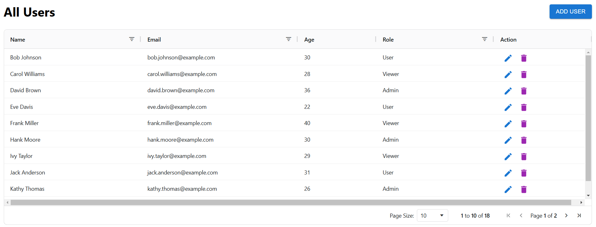
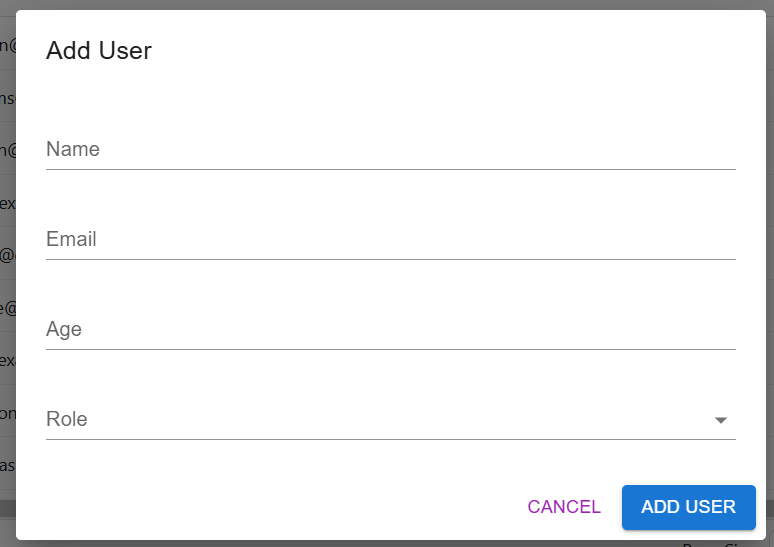
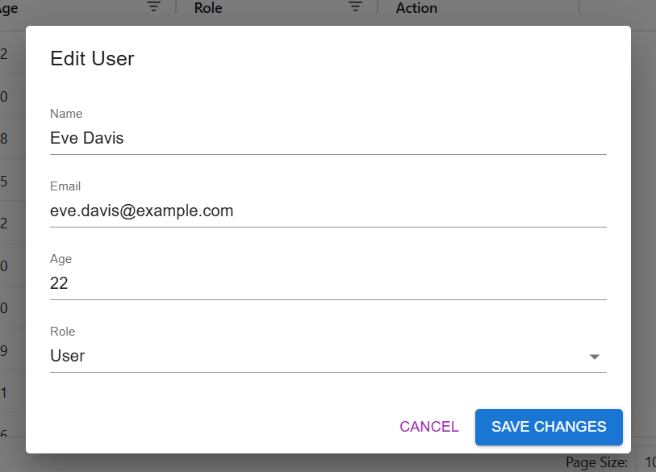
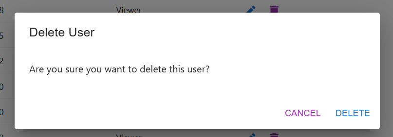

# User Management System

This project is a User Management System built with React, using Material-UI for the user interface and AG Grid for displaying user data. The application allows users to add, edit, and delete user records.

## Features

- User CRUD operations (Create, Read, Update, Delete)
- Data management with AG Grid
- Mock API with `json-server`

## Tech Stack

- React
- Material-UI
- AG Grid
- json-server
- TypeScript
- react-hook-form

### Installation

1. Clone the repository:
   git clone <repository-url>

2. Install the dependencies:
   npm install

3. Start the json server:
   npm run json-server

4. Run the project:
   npm run dev

## Screenshot

